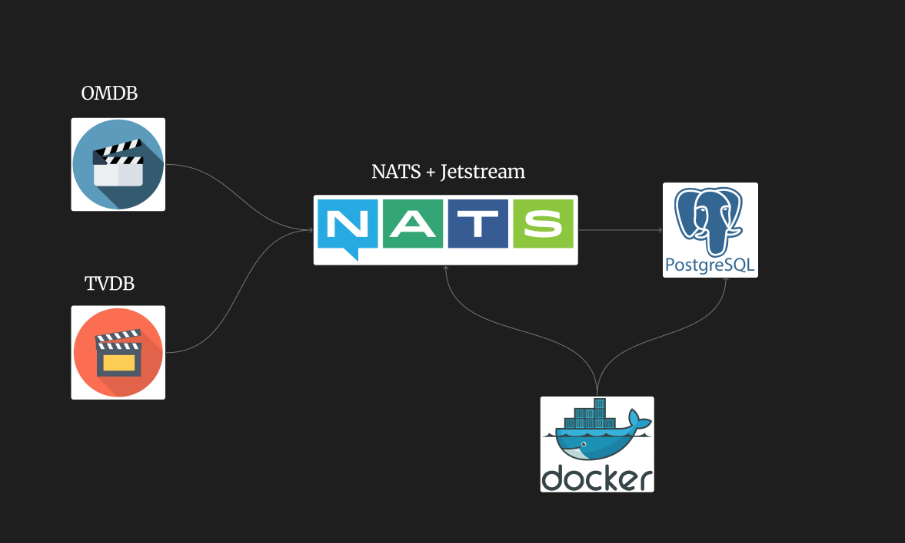
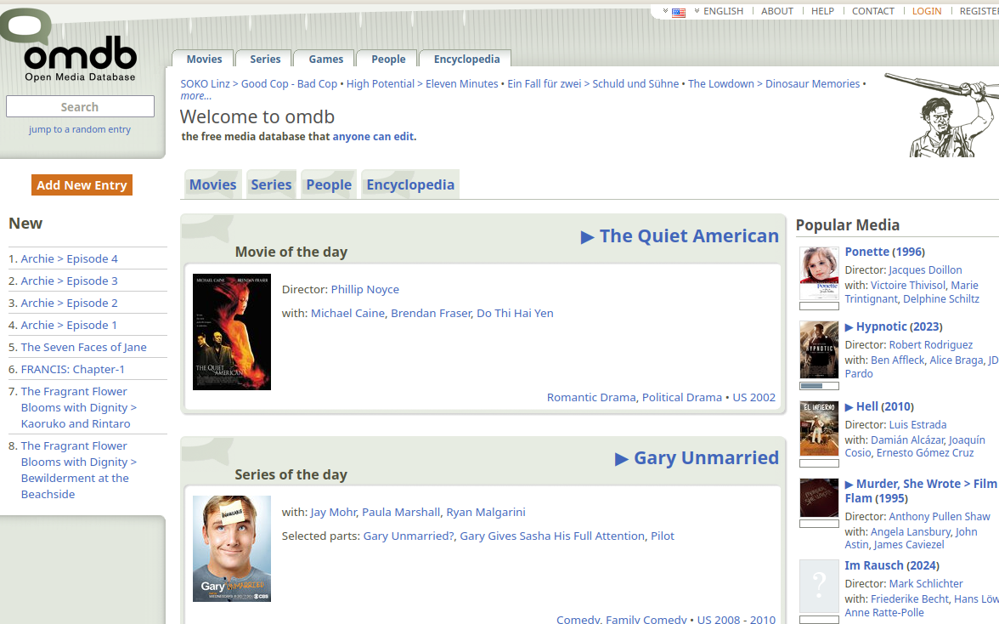
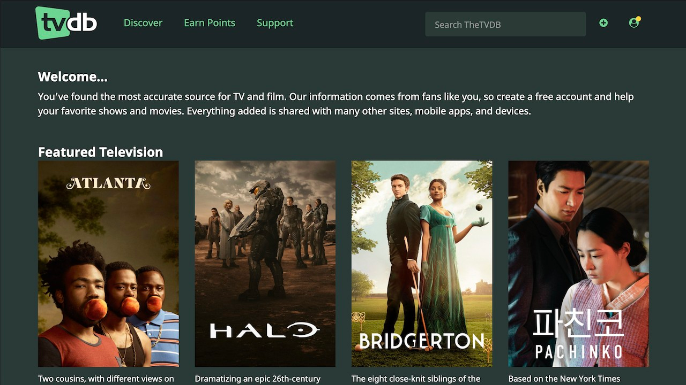
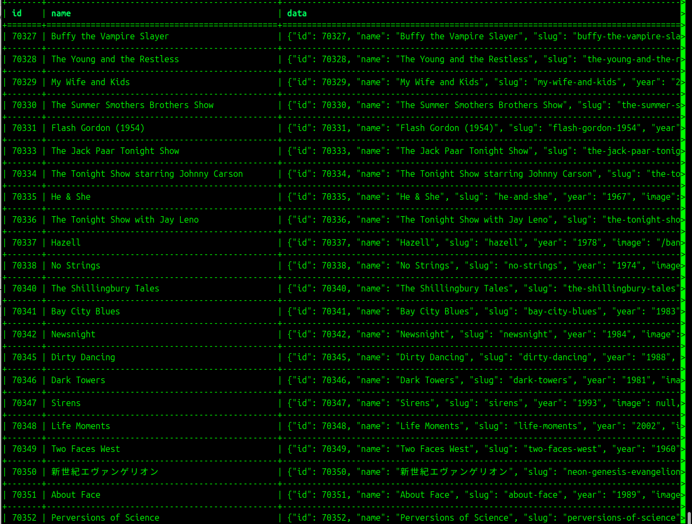

# Movie Analysis




# Movie Data Pipeline

This is a simple movie data pipeline.

In this project, I used the NATS server, which is much lighter than Apache Kafka. Normally, NATS core takes very little space (the deb package is around 10MB). If we want NATS to work stably, meaning it stores messages in queues and delivers them to consumers whenever needed, we should use JetStream.
JetStream acts as a storage. In this project, I used the file system as JetStream storage, but other storages can also be used (e.g., S3).


##  Requirements to run the project

You must get OMDB and TVDB API keys and put them in the places shown in the .env file.


## How to use

#### 1.Clone the repo:
```
https://github.com/Rafo044/movie_data_pipline.git
cd movie_data_pipline
```

#### 2.With this command you create a virtual environment and activate it:
To activate this, Python and a virtual environment must be installed.

```
make venv
```

#### 3.To activate use the following commands:
```
make activate
```


#### 4.Install the dependencies:
```
make install
```

#### 5.Bring up the containers:
```
make up
```
If the containers are healthy continue

#### 6.Create JetStream (By default the nats server does not enable it. In the compose file we enabled it with -js but the stream itself is not created)

```
make jetstream
```
#### 7.Start the publishers
```
make omdb_publisher
```
```
make tvdb_publisher
```

#### 8.Start the subscriber.
```
make subscriber
```

# About TVDB and OMDB databases


You can get API keys from these platforms and request movie information


## OMDb (Open Movie Database):

A database that provides movie and TV show information via an open API.
It allows you to get data in JSON format such as movie title, release year, director, actors, IMDb rating and poster.
Very useful for movie projects because it offers a free and RESTful API.




## TVDB (TheTVDB):

A database specialized for TV series and shows.
It provides episode, season, cast, poster and other metadata for each series.
Widely used for tracking series and integrating into applications via its API.




# Conf file

In the Conf folder, conf files are provided for Supervisor. Supervisor is a service like systemctl.
If you want, you can use this service to start Python files. If not, you can start them the traditional way (using make).

Supervisor service website:
https://supervisord.org/

# Result

The data remains as ID and JSONB (in the data column).


