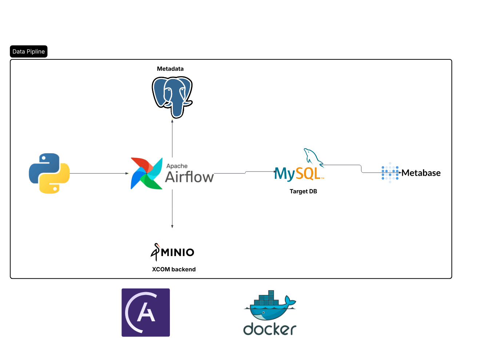
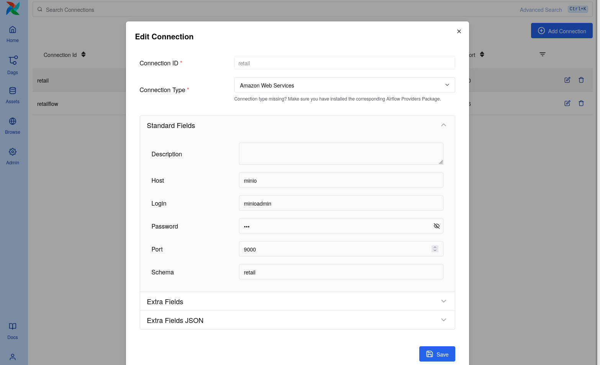
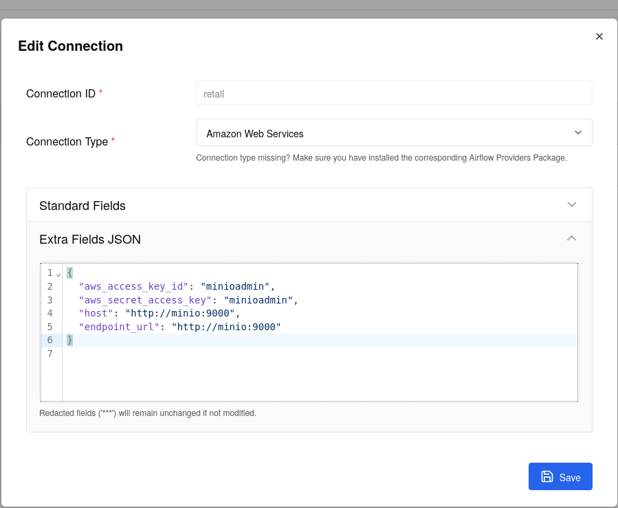
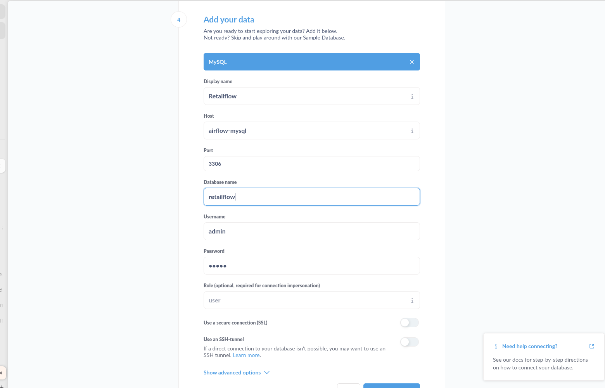
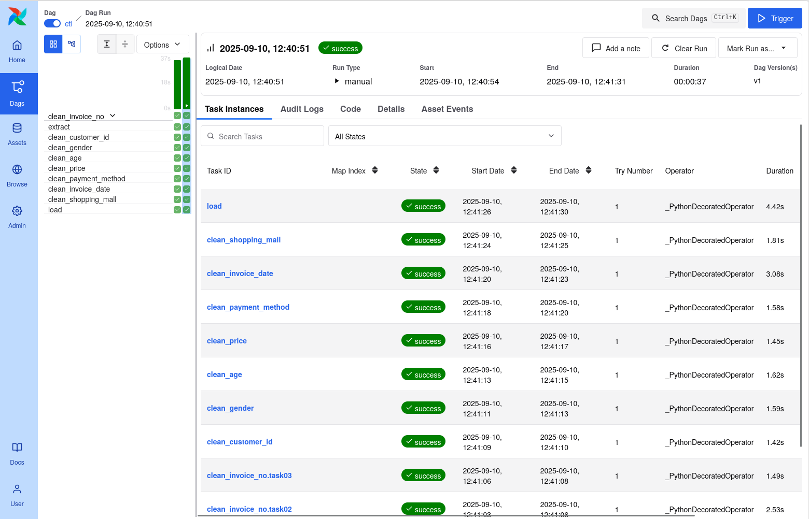
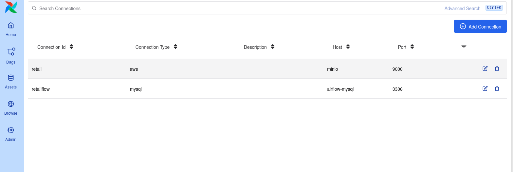

# Retailflow




# Retail Flow

## 1. About the project
This project builds a simple data pipeline for retail data.
It does ETL (extract, data quality checks) using pandas.
Airflow runs the pipeline. MinIO is used to store XCom objects (like pandas DataFrames).
MySQL stores results.Postgresql used metadata.

## 2. Pipeline image
The pipeline image is here:
docs/images/pipline.png


## 3. How to start the project

1. Clone the repo:
```
git clone https://github.com/Rafo044/Retailflow.git
cd Retailflow
```

2. Put the `.env` file in the project root (see sample below).

3. (Optional) If you have SQL init files for MySQL, put them in mysql-init/ folder.
Docker will run them automatically on MySQL start.

4. Start Airflow and other services:

- With Astro CLI:
```
astro dev start
```

- Or with Docker Compose:
```
docker-compose up -d
```

5. Open Airflow UI:
- http://localhost:8080

6. Run or check DAGs(before add airflow connections):
- Use Airflow UI or
```
astro dev run <dag_id>
```

## 4. Airflow connections (Conn IDs)

We use these Airflow connections:

- retail — MinIO (S3 API)




- retailflow — MySQL


All connection screenshots are in docs/images/ folder.

## 5. XCom backend — MinIO

We use MinIO as the XCom backend.
Pandas DataFrames and other objects are stored in MinIO.
Airflow keeps only references in XCom.
Screenshot: docs/images/xcom_minio.png

## 6. MySQL init files

If you want MySQL to run SQL files on start, put *.sql files in mysql-init/.
Docker mounts this folder to /docker-entrypoint-initdb.d automatically.

## 7. Sample `.env` file

```
# MySQL
MYSQL_ROOT_PASSWORD=admin
MYSQL_USER=admin
MYSQL_PASSWORD=admin
MYSQL_DATABASE=retailflow

# MinIO / S3 Airflow connection
AIRFLOW_CONN_MINIO_LOCAL='{
    "conn_type":"aws",
    "extra":{
        "aws_access_key_id":"minioadmin",
        "aws_secret_access_key":"minioadmin",
        "endpoint_url":"http://minio:9000"
    }
}'

# Object Storage Custom XCom Backend
AIRFLOW__CORE__XCOM_BACKEND="airflow.providers.common.io.xcom.backend.XComObjectStorageBackend"
AIRFLOW__COMMON_IO__XCOM_OBJECTSTORAGE_PATH="s3://retail@retail/xcom"
AIRFLOW__COMMON_IO__XCOM_OBJECTSTORAGE_THRESHOLD="0"
AIRFLOW__COMMON_IO__XCOM_OBJECTSTORAGE_COMPRESSION="zip"
```

- You can change MYSQL_PASSWORD or other values.
- If you want another XCom connection, change AIRFLOW__COMMON_IO__XCOM_OBJECTSTORAGE_PATH.


## 8. Airflow UI

### Airflow dag view


### Airflow connection list


## 9. File and screenshot locations

- Pipeline image: docs/images/pipline.png
- MinIO connection screenshot: docs/images/retail_minio_conn.png
- MySQL connection screenshot: docs/images/retailflow_mysql_conn.png
- XCom MinIO screenshot: docs/images/xcom_minio.png
- MySQL init SQL files: mysql-init/

---
