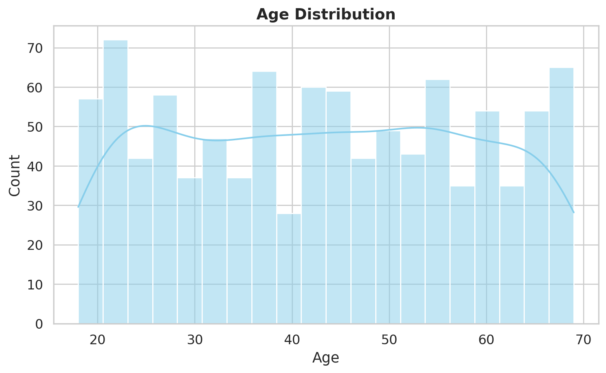
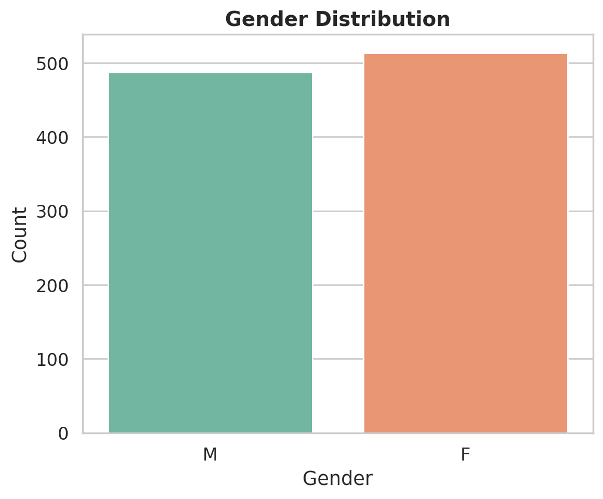
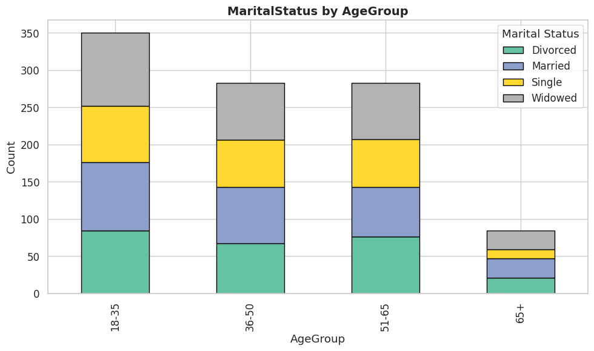
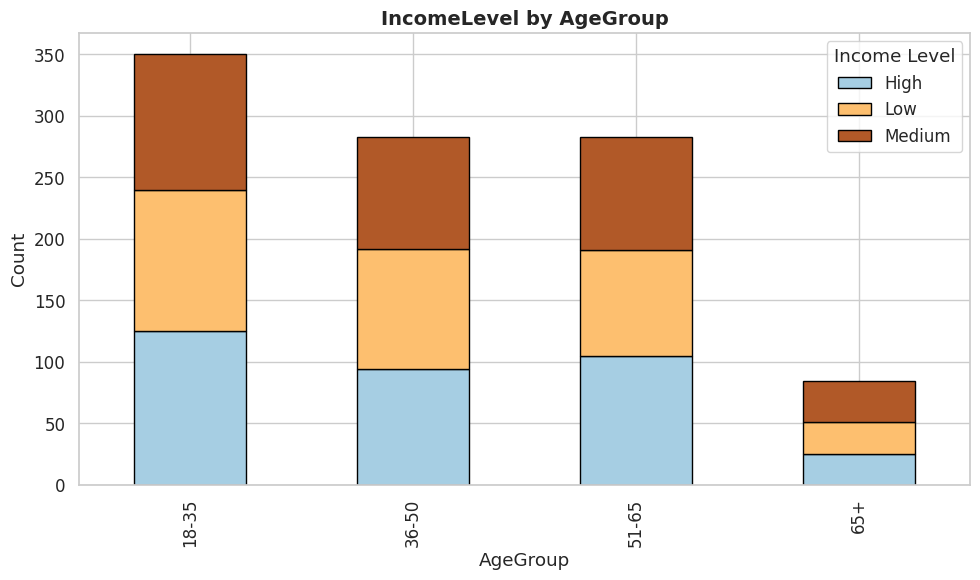
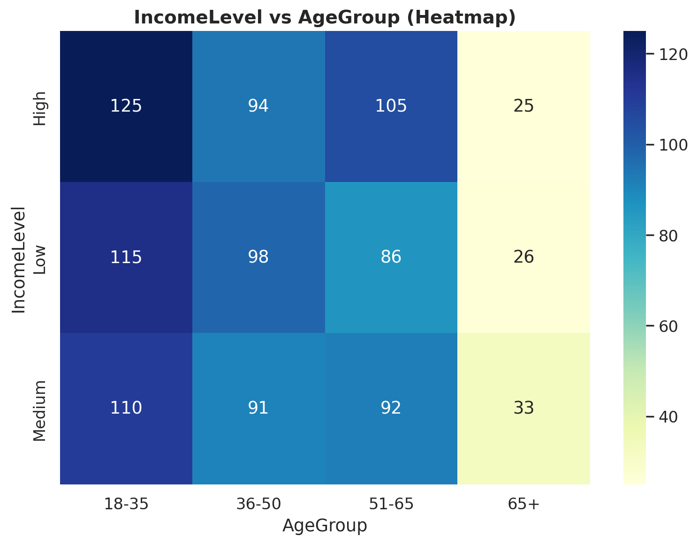

# Churn Prediction

# Customer Churn Prediction

## 1. Introduction

The goal of this project is to prepare data for **customer churn prediction**. We checked the data, did EDA (Exploratory Data Analysis), and suggested preprocessing steps.

**Dataset description:**

- **1000 rows**
    
- **5 columns:**
    
    - **CustomerID** – unique ID for each customer
        
    - **Age** – customer age (18–65)
        
    - **Gender** – M or F
        
    - **MaritalStatus** – Single, Married, Divorced, Widowed
        
    - **IncomeLevel** – Low, Medium, High
        

---

## 2. Exploratory Data Analysis (EDA)

### 2.1 Age Distribution

- Customer ages are mainly between 18 and 65.
    
- The age distribution is quite even, but some ages look too frequent (synthetic data sign).
    

### 2.2 Gender Distribution

- Gender is almost equal (balanced).

  
### 2.3 MaritalStatus vs IncomeLevel

| IncomeLevel | Divorced | Married | Single | Widowed |
| ----------- | -------- | ------- | ------ | ------- |
| High        | 82       | 98      | 75     | 94      |
| Low         | 87       | 86      | 62     | 90      |
| Medium      | 79       | 77      | 78     | 92      |

**Observation:**

- High and Medium income are evenly spread in all marital groups.
    
- Low income is similar but Single customers are fewer.
    

### 2.4 MaritalStatus vs AgeGroup

| AgeGroup | Divorced | Married | Single | Widowed |
| -------- | -------- | ------- | ------ | ------- |
| <18      | 4        | 8       | 7      | 5       |
| 18–35    | 80       | 84      | 69     | 93      |
| 36–50    | 67       | 76      | 63     | 77      |
| 51–65    | 76       | 67      | 64     | 76      |
| 65+      | 21       | 26      | 12     | 25      |

 

**Observation:**

- Age group 18–35 is the largest in all marital groups.
    
- Widowed is more common in young people (synthetic data).
    
- Age 65+ has mostly Married and Widowed.

- 
    
### 2.5 IncomeLevel vs AgeGroup

| AgeGroup | High | Low | Medium |
| -------- | ---- | --- | ------ |
| <18      | 4    | 10  | 10     |
| 18–35    | 121  | 105 | 100    |
| 36–50    | 94   | 98  | 91     |
| 51–65    | 105  | 86  | 92     |
| 65+      | 25   | 26  | 33     |
**Observation:**

- High income is mainly 18–35 (121 people).
    
- Low and Medium incomes are balanced across ages.
    
- Age 65+ mostly has Medium income.
    

 
 
 

---

## 3. Data Cleaning and Preprocessing

- **Missing values:** None.
    
- **Outliers:** Age has no extreme values (range 18–65).
    
- **Feature Engineering:** Added `AgeGroup` (<18, 18–35, 36–50, 51–65, 65+).
    
- **Encoding:**
    
    - Gender → Binary (M=1, F=0)
        
    - MaritalStatus, IncomeLevel, AgeGroup → One-hot encoding
        
- **Normalization:** Age can be scaled using StandardScaler or MinMaxScaler.
    
- **Redundant Columns:** CustomerID is not needed for the model.
    

---

## 4. Findings (Main observations)

- Age is strongly related to IncomeLevel and MaritalStatus.
    
- Age 18–35 dominates both marital status and high income groups.
    
- Widowed in young people and many young high-income customers are signs of synthetic data.
    
- Dataset does not fully match real-world patterns but is useful for model preparation.
    

